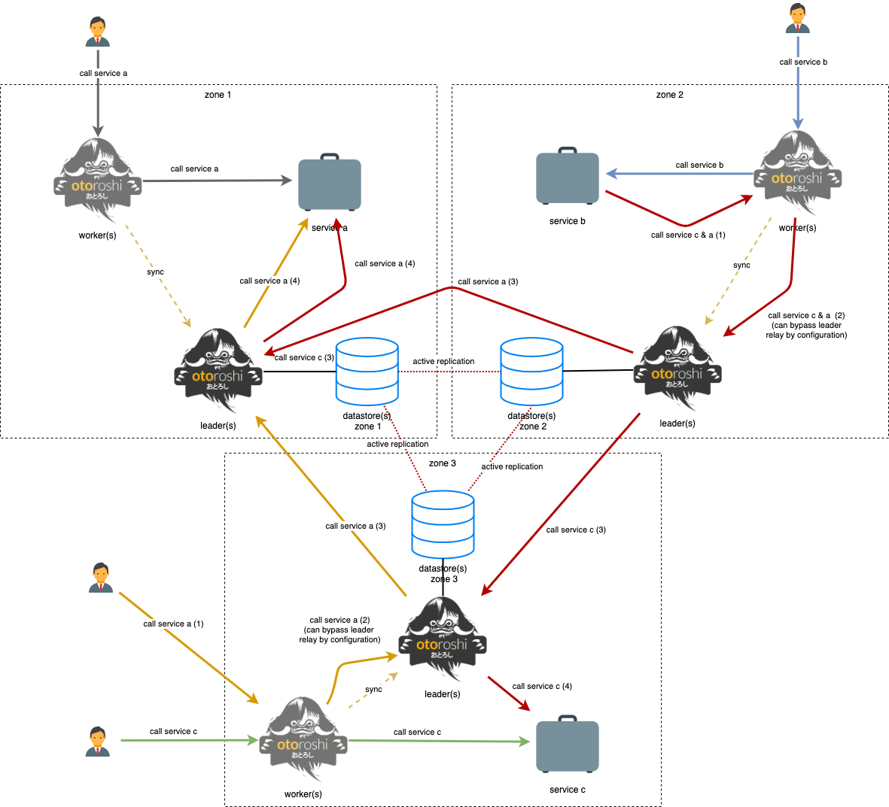

# relay demo

this demo shows how an otoroshi cluster can be deployed on mutliple network zones where apps can communicate between zones with otoroshi instances acting as relays automatically. In this scenario, each service and otoroshi instance declares where it is located (using metadata) and otoroshi will handle relay routing between instances. In order to make everything work, otoroshi leaders should be able to communicate freely with each others.



in this demo, we do not use a replicated datastore. otoroshi leader instance are located in their own zone network but also have access to another network where a redis instance is deployed.

## Build otoroshi

as there is no release with the relay feature yet, to be able to run the demo, you need to build an otoroshi jar file first. Once created, copy the jar file in the `otoroshi` folder

```sh
cd ../../otoroshi/javascript
yarn install
yarn build
cd ..
sbt ';clean;compile;assembly'
cp ./target/scala-2.12/otoroshi.jar ../demos/relay/otoroshi/otoroshi.jar
```

## Start

start everything with 

```sh
docker-compose up
```

then import the `otoroshi.json` file through the `Danger Zone` if it's the first time

## Test

run test calls with

```sh
sh ./call.sh
```

## Stop

shutdown everything with 

```sh
docker-compose down
```